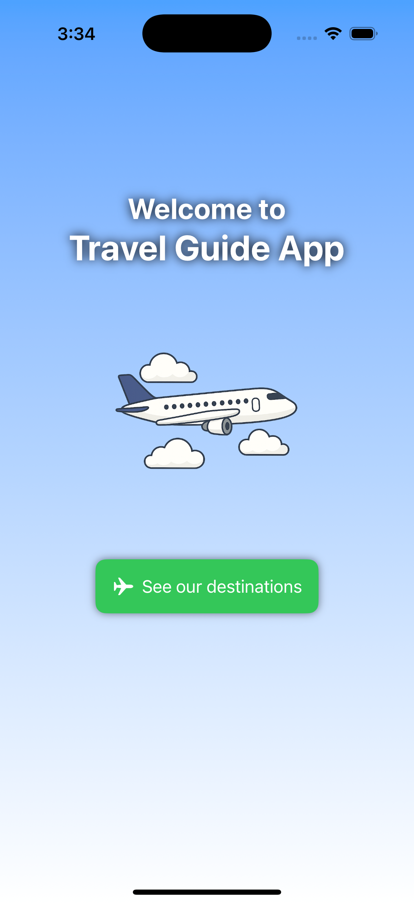
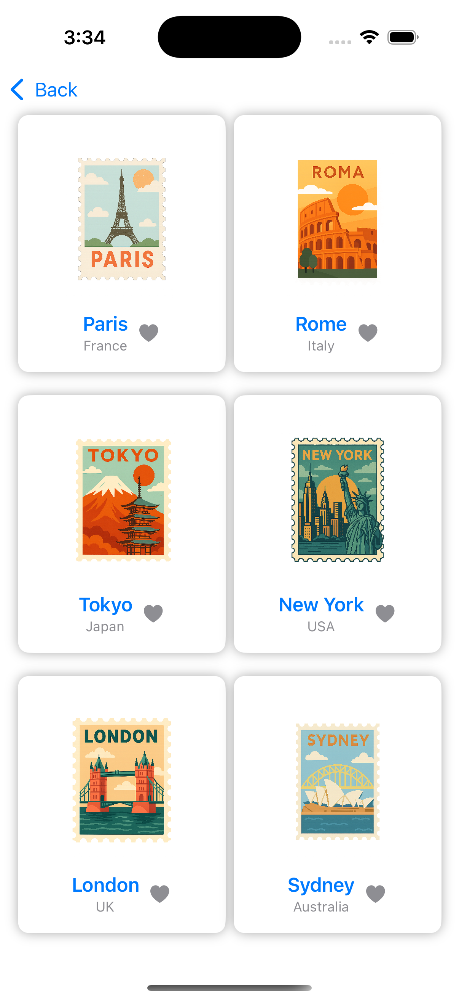
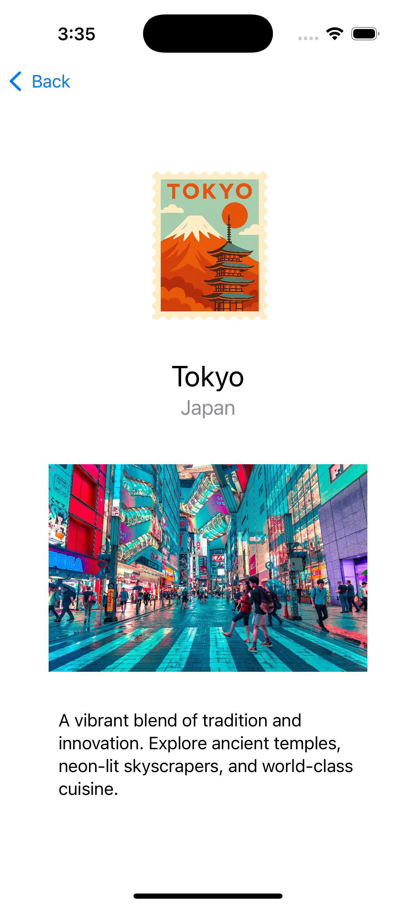

# ✈️ Travel Guide App

A simple app built with **SwiftUI** to explore popular travel destinations around the world.  
This project was created as a hands-on learning experience, focusing on navigation, layout design, and building reusable views.

---

## 🛠️ Technologies Used

- **SwiftUI**
- **NavigationView & NavigationLink**
- **SF Symbols**
- **Custom reusable views**
- **Custom fonts**
- **Basic button components**
- **Layouts using VStack, HStack, and ZStack**
- **Gradient backgrounds**
- **ForEach and List**
- **ScrollView for vertical content**

---

## 🖼️ Screenshots

| Welcome | Catalog | Detail |
|--------|---------|--------|
|  |  |  |

---

### 🎥 App Demo

https://github.com/franciscoxcasillas/TravelGuideApp/blob/main/Media/demo.mp4

---

## 🚀 What I learned

- How to structure a SwiftUI app with multiple screens using `NavigationView` and `NavigationLink`.
- Creating visually appealing layouts with gradients, spacing, and hierarchy.
- Working with reusable views and maintaining clean component structure.
- Displaying lists and looping through data with `ForEach` and `List`.
- Importing and styling images (local and remote), and using SF Symbols for UI icons.

---

## 📦 Try it out

This project is part of my journey learning SwiftUI and mobile app development.  
There’s no state or data-binding logic yet — it's focused purely on structure and layout.

---

## 💬 Contact

Feel free to reach out or connect:

- [Twitter](https://x.com/chiccasillas)
